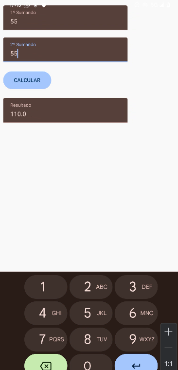

# CalculatorKotlinJetpack

A simple calculator developed in Kotlin using Jetpack Compose for the graphical interface.

## Features
- Input validation.
- Read-only result field.

## Requirements
- Android Studio or IntelliJ IDEA.
- An Android emulator or physical Android device for testing.

## How to Run

### First Step:
Clone the repository:
bash
git clone https://github.com/LHdezLP/KotlinCalculator.git

### Second Step:
Open the project in Android Studio or IntelliJ IDEA.

### Third Step:
Ensure you have an Android Virtual Device (AVD) configured or a physical Android device connected.

For an emulator:

Open the AVD Manager from Android Studio.
Create a new virtual device or select an existing one.
Launch the emulator.
For a physical device:

Enable Developer Options on your device.
Turn on USB Debugging.
Connect your device to your computer via USB.

### Fourth Step:
Run the project:

Click the Run button in Android Studio or IntelliJ IDEA.
Select the target device (emulator or physical device) and wait for the application to launch.

## Project Description
This project demonstrates how to create an Android application using Jetpack Compose for the graphical interface. It is a simple calculator that allows users to input two numbers (including decimals and negative values), and it calculates and displays their sum.

## Compilation Instructions
### First Step:
Ensure you have the following installed:

Android Studio (latest version recommended).
Kotlin Plugin (already included in Android Studio).
Android SDK (configured in Android Studio).

### Second Step::
Open the project in Android Studio and sync Gradle:

This will automatically download the necessary dependencies.

### Third Step:
Compile the project by selecting Build > Make Project in Android Studio.

Run the project following the steps outlined above.

## Screenshots

